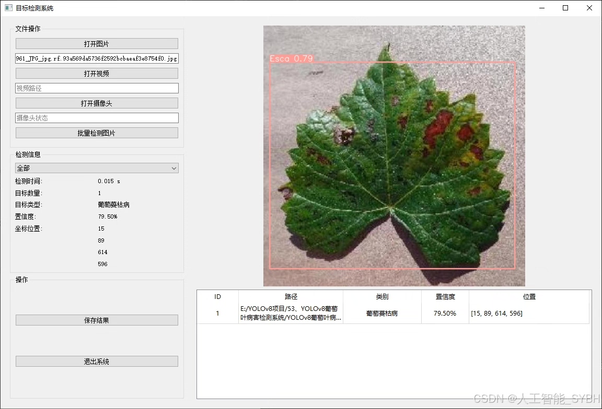
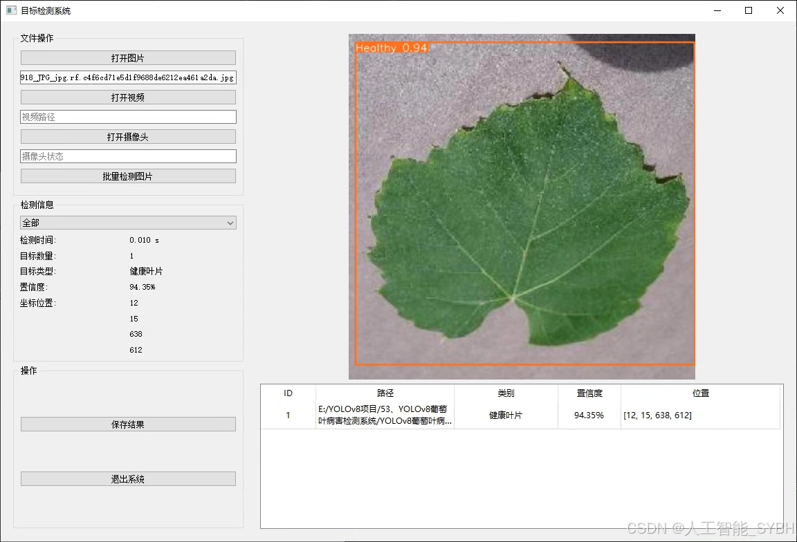
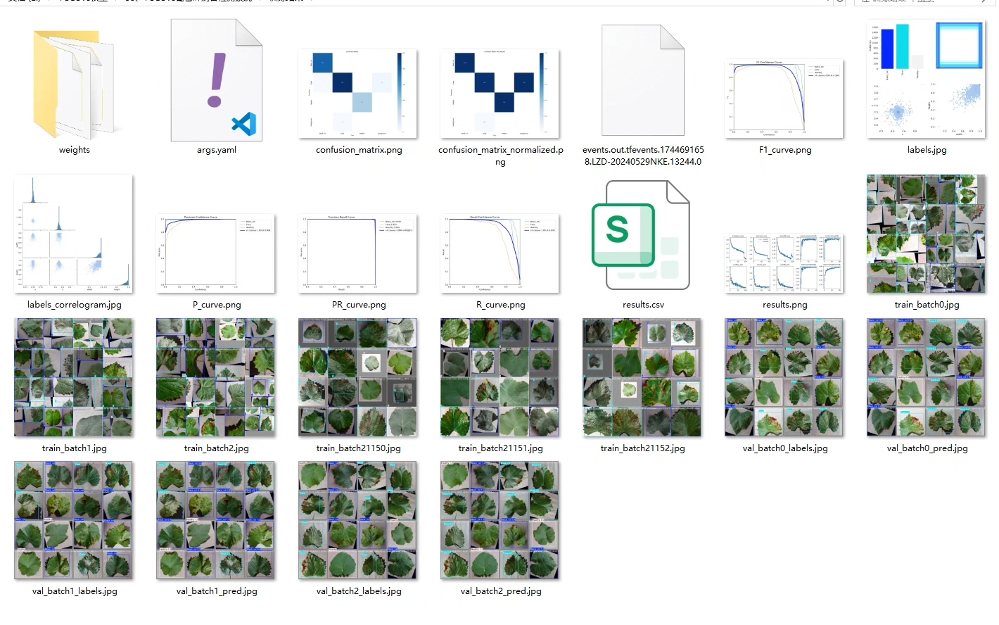
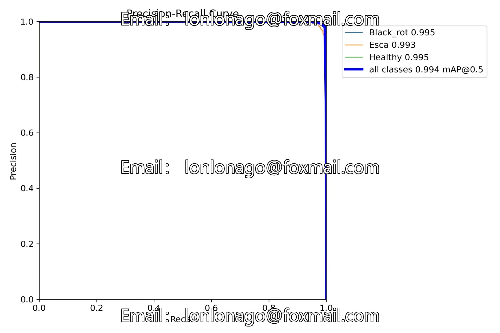
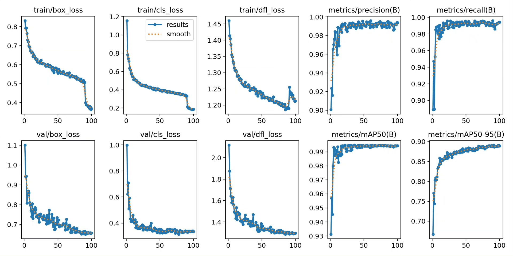
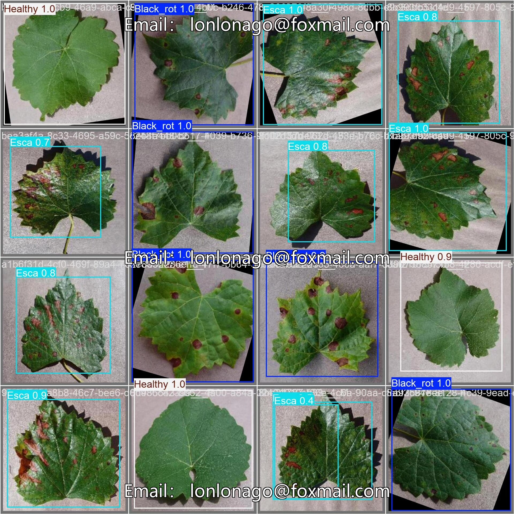
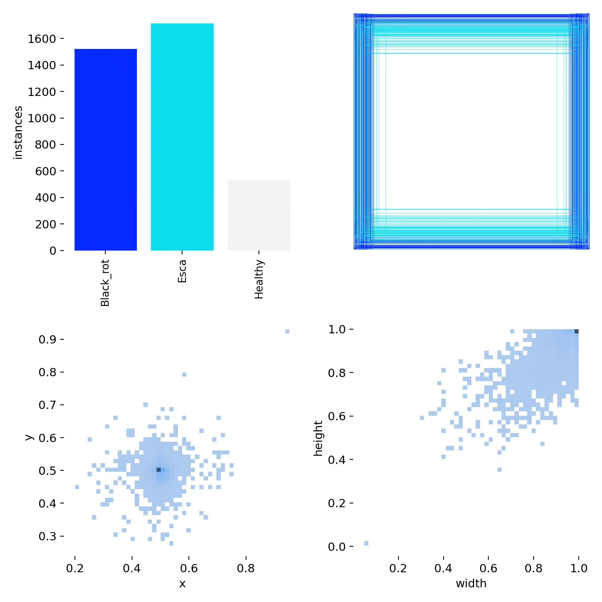
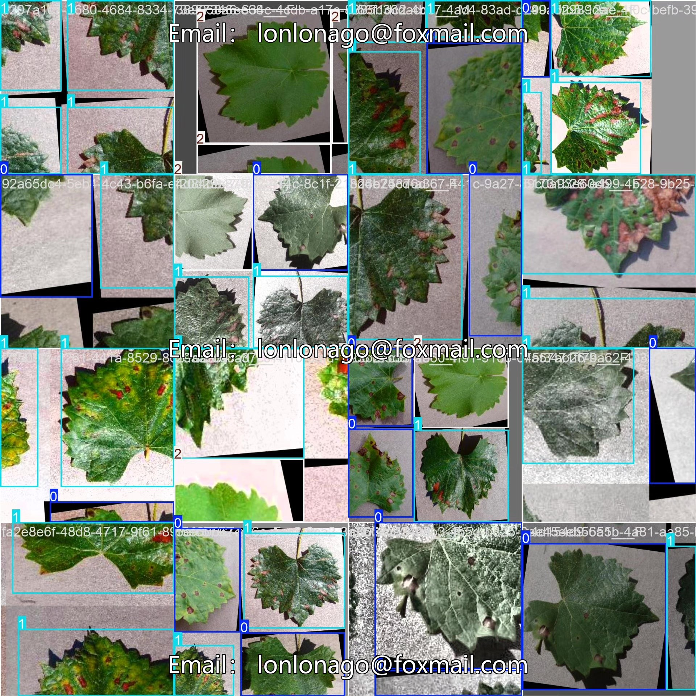

# Grape leaf disease detection system based on YOLOv8 deep learning (YOLOv8+)

## Body

Based on the YOLOv8 deep learning framework, this project has developed a set of intelligent systems specifically for grape leaf disease detection. The system can accurately identify three states of grape leaves: Black rot (Black_rot), Escalation (Esca), and Healthy. The system is trained using a large-scale professional dataset, including 3758 training images, 538 validation images, and 1074 test images, totaling 5370 high-quality labeled images to ensure that the model has excellent detection performance and generalization capabilities.

The company's products have obtained the official commercial license certification from YOLO.

We provide after-sales service.

After payment, we will provide WeChat IDs for instant questions and answers.

Environmental configuration: We will provide an instructional tutorial on environmental configuration, and WeChat will provide Q&A.

Remote installation services: If you need remote configuration, an additional fee of 69 is required, with all fees refunded if the configuration fails (only the installation fee is refunded for older computers).

Retraining the dataset: After setting up the environment, you can train on your own computer. If you need us to retrain, just pay 69 plus computing power fees (2.5 yuan/hour).

Full after-sales service

## Images

## Payment

Here is a pay link on Stripe ( https://buy.stripe.com/3cs8yP7sY87d0vu9AB ). Please contact me lonlonago@foxmail.com after funding $89, and I will send you a complete data files , thank you!

